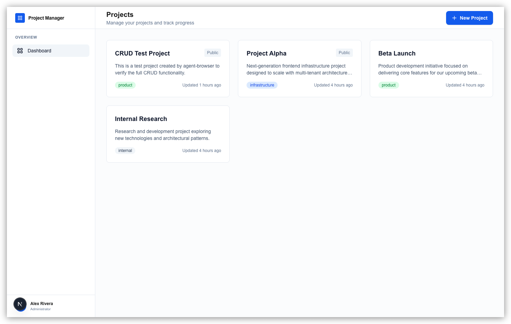

# Next.js CRUD Sample Application

A production-ready sample application demonstrating modern Next.js patterns with TypeScript, Radix UI, and PostgreSQL.

<p align="center">
  
</p>

## Purpose

This is a **learning-focused project** designed for developers who:
- Know TypeScript and React basics
- Want to learn Next.js 16 App Router patterns
- Want to understand production-ready architectures
- Are preparing to build real-world applications

This is **not production code**, but rather a well-documented example that teaches the patterns you'd use in production.

## Tech Stack

- **Next.js 16.1.6**: React framework with App Router
- **React 19**: Latest React with Server Components and Server Actions
- **TypeScript 5**: Type-safe development with strict mode
- **Tailwind CSS v4**: Utility-first styling with dark mode
- **PostgreSQL 17**: Database via Docker with postgres.js driver
- **Radix UI**: Accessible component primitives
- **Zod v4**: Runtime validation and type inference

## Features

This CRUD application demonstrates:

- ✅ **Create, Read, Update, Delete** projects
- ✅ **Server Components** for data fetching
- ✅ **Server Actions** for mutations (no API routes!)
- ✅ **Form validation** with Zod
- ✅ **Progressive enhancement** (works without JavaScript)
- ✅ **Dark mode** support
- ✅ **Accessible components** with Radix UI
- ✅ **Type-safe** database operations
- ✅ **Responsive design**

## Getting Started

### Prerequisites

- Node.js 18 or later
- pnpm
- Docker (for PostgreSQL)

### Installation

```bash
# Install dependencies
pnpm install

# Start PostgreSQL and dev server
make dev
```

Or manually:

```bash
docker compose up -d   # Start PostgreSQL
pnpm dev               # Start dev server
```

Open [http://localhost:3000](http://localhost:3000) to see the application.

### Database

PostgreSQL runs in Docker via `docker-compose.yml`. The database schema and seed data are **automatically created** on first run. No migrations or setup scripts needed.

## Project Structure

```
app/                    # Next.js App Router pages
  (dashboard)/          # Route group (sidebar layout)
    page.tsx            # Project list
    projects/
      new/              # Create project
      [id]/             # View/edit project
lib/
  db/                   # Database layer
  actions/              # Server Actions
  validations/          # Zod schemas
components/
  ui/                   # Generic UI components
  dashboard/            # App-specific components
docs/                   # Comprehensive documentation
```

## Documentation

**Start here:** [`docs/README.md`](docs/README.md)

The `docs/` folder contains comprehensive guides that explain not just what the code does, but **why** it's structured this way:

1. [**Architecture Overview**](docs/01-architecture.md) - High-level patterns and decisions
2. [**Database Design**](docs/02-database.md) - Schema, repository pattern, and PostgreSQL
3. [**Routing and Rendering**](docs/03-routing-and-rendering.md) - Server vs Client Components
4. [**Components and Styling**](docs/04-components-and-styling.md) - Radix UI and Tailwind
5. [**Forms and Validation**](docs/05-forms-and-validation.md) - Server Actions and Zod

## Key Concepts

### Server Components First

Pages fetch data directly from the database without API routes:

```typescript
// app/(dashboard)/page.tsx
export default async function DashboardPage() {
  const projects = await getAllProjects();  // Direct DB access
  return <ProjectList projects={projects} />;
}
```

### Server Actions for Mutations

Forms submit to Server Actions instead of API routes:

```typescript
// lib/actions/projects.ts
'use server';

export async function createProject(formData: FormData) {
  // Validate, create, redirect
}
```

### Hybrid Component Pattern

Server Components render Client Components that call Server Actions:

```
Server Component (fetches data)
  └─ Client Component (interactivity)
      └─ Calls Server Action (mutation)
```

## Development Commands

```bash
make dev              # Start PostgreSQL + dev server
docker compose up -d  # Start PostgreSQL only
pnpm dev              # Start development server
pnpm build            # Build for production
pnpm start            # Start production server
pnpm lint             # Run ESLint
```

## What's Intentionally Missing

To keep the focus on core patterns:

- **Authentication**: Would add complexity
- **Tests**: Out of scope for this example
- **Complex state management**: React 19 handles it
- **ORM**: Raw SQL teaches fundamentals
- **Multi-user support**: Single-developer scope

These can be added as you scale the application.

## Learning Path

1. **Run the app** and explore the UI
2. **Read the documentation** in the `docs/` folder
3. **Study the code** - every file has extensive comments
4. **Make changes** to understand how it all connects
5. **Apply these patterns** to your own projects

## Production Considerations

When adapting this for production:

- Add authentication (NextAuth.js, Clerk, etc.)
- Add comprehensive tests
- Implement proper error boundaries
- Add logging and monitoring
- Set up CI/CD
- Configure proper database migrations
- Add caching strategies

## Resources

- [Next.js Documentation](https://nextjs.org/docs)
- [React Server Components](https://react.dev/reference/rsc/server-components)
- [Radix UI](https://www.radix-ui.com/)
- [Tailwind CSS](https://tailwindcss.com/)
- [Zod](https://zod.dev/)

## Contributing

This is a learning resource. Feel free to:
- Fork and experiment
- Use as a template for your projects
- Share with others learning Next.js

## License

Open source - use however you want for learning purposes.
